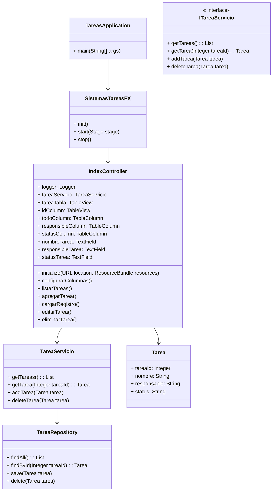

# Sistema de Tareas con Spring y JavaFX

Esta aplicación permite la gestión de tareas por realizar, incluyendo:

-   **Visualización:** Muestra una tabla con las tareas, su responsable y estado actual (pendiente, realizada o en progreso).
-   **Monitoreo:** Permite realizar un seguimiento del progreso de las tareas, identificando las que ya se han completado, las que están en curso y las que aún no se han echo.

**Tecnologías:**

-   **Java:** Lenguaje de programación principal utilizado para desarrollar la aplicación.
-   **Spring:** Framework de desarrollo Java que facilita la creación de aplicaciones web y de escritorio. En este proyecto, se utiliza para:
    
    -   **Configuración:** Gestionar la configuración de la aplicación, como la conexión a la base de datos.
    -   **Inyección de dependencias:** Facilitar la creación y gestión de objetos que la aplicación necesita.
    -   **Acceso a datos:** Implementar la capa de acceso a datos, utilizando Hibernate.
    
-   **Hibernate:** Framework de mapeo objeto-relacional (ORM) que facilita la persistencia de datos en una base de datos. En este proyecto, se utiliza para:
    
    -   **Mapeo de objetos:** Convertir objetos Java en entidades de la base de datos y viceversa.
    -   **Consultas:** Realizar consultas a la base de datos para recuperar y actualizar información.
    
-   **JavaFX:** Framework para la creación de interfaces gráficas de usuario (GUI) en Java. En este proyecto, se utiliza para:
    -   **Diseño de la interfaz:** Crear la interfaz gráfica de usuario de la aplicación, incluyendo la tabla, los botones y los formularios.
    -   **Interacción con el usuario:** Gestionar la interacción del usuario con la aplicación, como la creación, edición y eliminación de tareas.
    
## Diagrama de clases


##  Estructura del Proyecto
```
├── com
│ ├── tareas
| |	  ├── controller
| |   │ │ └── IndexController.java
| |	  |	│ ├── models
| |	  |	│ │ └── Tarea.java
| |	  |	│ ├── repositoy
| |	  |	│ │ └── TareaRepository.java
| |	  |	│ ├── services
| |	  |	│ │ ├── ITareaServicio.java 
| |	  |	│ │ └── TareaServicio.java
| |	  |	│ ├── presentaciones
| |	  |	│ │ └── SistemasTareasFX.java
│ └── TareasApplication.java
└── pom.xml
```
## Imagenes del proyecto
Sistema tareas tabla

Stsema Tareas Error validacion

Sistema Tareas tarea Agregada

Tarea Agregada

Sistema Tareas tarea Modificada

Tarea Eliminada
